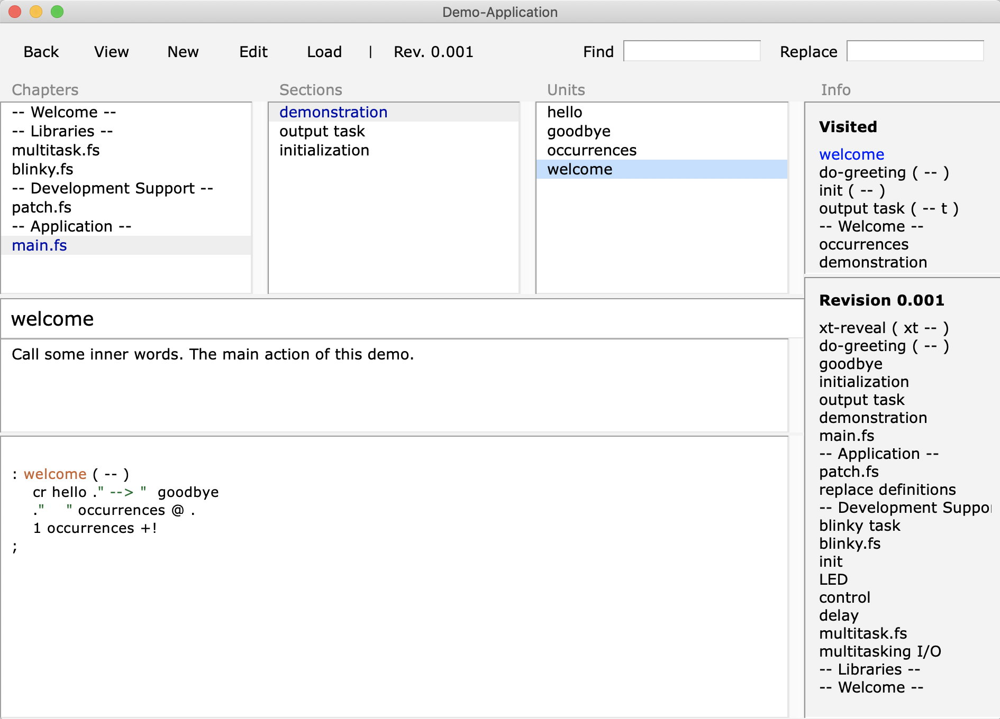

# HolonCode ESP32forth Integration

This repository contains a setup of a development environment that uses

- [Holon](https://holonforth.com/holons.html) by Wolf Wejgaard  
  The structured hypertext source code management tool for interactive program development

as a front end to manage source code for programming applications using

- [ESP32forth](https://esp32forth.appspot.com/ESP32forth.html) by Brad Nelson  
  An interactive programming environment for the ESP32 microcontrollers.

This setup has been tested with Mac OS and Linux. YMMV.



## Prerequisites

What you need to setup this environment is

- a working installation of HolonCode from 
  [The HolonCode Github repository](https://github.com/wejgaard/HolonCode)
  or use the suplied copy in the subdirectory `HolonCode`.

- an ESP32-Board flashed with [ESP32forth](https://esp32forth.appspot.com/ESP32forth.html) such as one of the numerous [ESP32](https://en.wikipedia.org/wiki/ESP32) development boards.

- serial communication to ESP32forth by means of a terminal program (such as [picocom](https://github.com/npat-efault/picocom)) see `config.sh` and `terminal` scripts for appropriate settings.

- the files in this repository

## Setup for the impatient

### Prepare ESP32forth, load libraries and interactive development support

- prepare a load-file `load-libraries` that loads all library definitions required by your applications in correct order (use provided file as starting point)
- for interactive development this includes `patch.fs`
- development of ESP32forth application project (`Demo-application`) takes place on top of the libraries

### Interactive Terminal

- connect to ESP32forth via serial device using terminal program: `./terminal`

### Load application 

- prepare a load-file `load-demo-application` (change name as desired) that loads the definitions of your applications in correct order
- use this load-file to load the application: `./load-demo-application`

### Monitor

- start the monitor that watches `holon.mon` and transfers it to ESP32forth on change: `./ESP32forth-monitor`

### HolonCode

- start HolonCode on Demo-Application:  
  `cd Demo-Application; tclsh ../HolonCode/holoncode.tcl Demo-Application.hdb &`


## The longer story: How it works

The HolonCode ESP32forth integration consists of 5 parts:

1. HolonCode: Structured source code management and overall control
     - fills the file `holon.mon` with the source code of a unit that the user `LOAD`s
     - manages all source files of the entire project in the project's directory

2. `ESP32forth-monitor`: a shell script that observes `holon.mon`
     - forwards the unit source code with appropriate prefix and suffix to the target
     - net effect ist to replace the definition of the unit in the target

3. `load-libraries`, `load-demo-application`: helper shell scripts
     - upload base libraries (and Holon ESP32 integration support) to the target (`load-libraries`)  
       Could be put in flash to reduce upload time of the application
     - upload application source code (`load-demo-application`) to target (RAM).

4. `terminal`: a serial connection to the target
     - Manages the serial line
     - shows ongoing traffic especially output of the target system.
	
5. Target: ESP32forth
     - runs interactive Forth
	 - executes application


```
+-------------+
|             |
|             |                                                                        +--------------------+
|             |   LOAD   +---------+   on change    +-------------------+    upload    |                    |
|  HolonCode  +--------->|holon.mon|--------------->|ESP32forth-monitor |------------->| Target: ESP32forth |
|             |          +---------+                +-------------------+              |                    |
|             |                                                                        +--------------------+
|             |                                                                             ^     ^         ^
+-------------+                                                                             |     |         |
       |                                                                                    |     |         |
       |manages                                                                             |     |         |
       +--------------------+                                                               |     |         |
       |                    |                                            +--------+         |     |         |
       |                    |                                            |Terminal|<--------+     |         |
       |                    v                                            +--------+               |         |
 +-----v-------+     +-------------+                                                              |         |
++------------+|   +-+-----------+ |                                                              |         |
|Library      ||   |Application  | |                                                              |         |
|Source Code  ||   |Source Code  | |                                                              |         |
|             ||   |             | |                                                              |         |
|             ||   |             | |                                                              |         |
|             ++   |             +-+                                                              |         |
+-------------+    +-------------+                                                                |         |
       |                  |                        +----------------------+                upload |         |
       |                  +----------------------->|load-demo-application |-----------------------+         |
       |                                           +----------------------+                                 |
       |                                           +-------------------+                             upload |
       +------------------------------------------>|   load-library    |------------------------------------+
                                                   +-------------------+
```


### Setup work environment

- The developer adapts the scripts `load-libraries` and  `load-demo-application` to her needs 
  maybe even renaming them appropriately.

- The developer starts `terminal` in order to configure the serial line and connect to the target. 
  He can input commands and observe the output of the target.
  
- The developer uploads the source code of any library code into the target by invoking `load-libraries`.
  This also contains support for the target system to **replace** old word definitions by new definitions.
  It's possible that there is no library code at all.
  There are are no supposed changes in this part - it can go into flash.

### Non-incremental Development with HolonCode

- The developer modifies the application source code within HolonCode.

- Once satisifed with the current source code the developer uploads the entire application 
  source code to the target by invoking `load-demo-application`.
  Changes are expected in this part. It goes into RAM.
  
- If the developer intends to do incremental changes, then the application should start in an infinite 
  background loop so that the target text interpreter can still accept commands.

### Incremental Development with HolonCode

- The developer modifies a unit.

- When the developer finishes editing a unit in HolonCode she presses the `LOAD` button.

- HolonCode writes the unit source code to `holon.mon`.

- `ESP32forth-monitor` detects the change in `holon.mon` and uploads the changed word definition to the ESP32forth target.


#### How does the incremental replacement of word definitions work?

Traditonally Forth allows for _redefinition_: you can define a new word with an existing name. 
The old definition stays in place and can even be used with its name in the new definition (no recursion).

Holon requires new word definitions to replace old definitions in order to support incremental development.

This is achieved by the word `revise` defined in the file `patch.fs` and loaded into the target system. 
The implementation of `revise` is highly system specific. It's usage however is universal. 
It is used in the following way:

```forth

: some-name ( -- )
    ...
;
revise
```

`revise` takes the new definition extracts its name and replaces an existing definition with the same name (if any) by the new definition.
It then hides the new definition name, so that the process can be repeated again later.
Any even earlier defined words with the same name are unaffected. 

So you can have the old Forth behaviour if you don't use `revise` and have the Holon require functionality if you do.

`ESP32forth-monitor` appends `revise` to the unit source code when uploading it to the target so that
the replacement takes place.
Note that old revisions of the word definition are not removed from the dictionary so memory could fill up.
If this turns out to be an issue then restart the target system and reload the application source code.

----

Remarks, hints and corrections are very welcome. Please contact Ulrich Hoffmann `<uho@xlerb.de>` for this.

My the Forth be with you. Live long and prosper.
